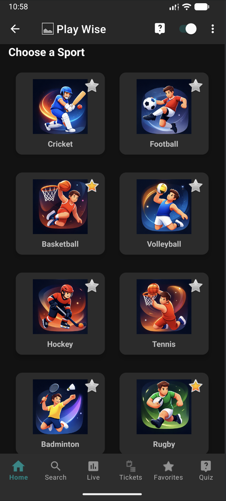

<div align="center">


# 🏆 PlayWise

### Your Ultimate Sports Companion App

*Learn • Explore • Compete*

<br/>

[](https://kotlinlang.org/)
[](https://developer.android.com/)
[](https://m3.material.io/)
[](https://developer.android.com/jetpack/androidx/releases/room)
[](https://developer.android.com/topic/architecture)
[](https://developer.android.com/about/versions/nougat)
[](LICENSE)

<br/>

[📱 Features](#-features) •
[📸 Screenshots](#-screenshots) •
[🏗️ Architecture](#%EF%B8%8F-architecture) •
[🛠️ Tech Stack](#%EF%B8%8F-tech-stack) •
[🚀 Getting Started](#-getting-started) •
[📁 Project Structure](#-project-structure) •
[👨‍💻 Developer](#-developer)

</div>

---

## 📖 Overview

**PlayWise** is a modern, feature-rich Android sports companion application built entirely in **Kotlin**. Whether you're a beginner wanting to learn sport rules or an enthusiast who loves quizzes and live scores — PlayWise has everything in one place.

The app covers **8 major sports**, provides interactive quizzes with persistent history, ground information with stadium details, ticket utilities, video tutorials, favorites management, and much more — all wrapped in a clean **Material Design 3** UI with full **Dark Mode** support.

---

## ✨ Features

<table>
<tr>
<td width="50%">

### 🏠 Core
- 🔍 **Searchable Sports Grid** — Cricket, Football, Basketball, Volleyball, Hockey, Tennis, Badminton, Rugby
- 🌙 **Dark / Light Mode** — Toggle anytime from the toolbar
- 📡 **Offline Indicator** — Real-time internet connectivity detection
- 🎨 **Splash Screen** — Branded animated entry screen

</td>
<td width="50%">

### ⭐ Personalization
- **Favorites System** — Star any sport and revisit instantly
- **Persistent Favorites** — Saved across sessions with SharedPreferences
- **Quick Access** — Details, Watch, and Quiz directly from Favorites

</td>
</tr>
<tr>
<td>

### 🧠 Sports Knowledge
- 📖 **Rules** — Structured, readable rules with TextToSpeech (TTS) support
- 🏟️ **Ground Info** — Famous stadiums per sport with capacity & match history
- 💡 **Pro Tips** — Batting, bowling, attacking & defensive tips

</td>
<td>

### 🎮 Interactive Quiz
- Multiple choice questions (5 per session)
- Score tracking with result summary
- Randomized questions every session
- **Full history** stored in Room Database
- Per-sport quiz filtering

</td>
</tr>
<tr>
<td>

### 🎟️ Tickets & Matches
- 🔥 **Trending Matches** — Upcoming fixtures with Book Now links
- 🏅 **Popular Leagues** — IPL, ISL, NBA, Premier League & more
- 📍 **Nearby Stadiums** — Location-based stadium ticket search
- 📅 **Add to Calendar** — Save upcoming matches to device calendar

</td>
<td>

### 📺 Multimedia
- 🎬 **Watch Videos** — YouTube tutorials per sport (Batting, Bowling, Fielding, Highlights)
- 📤 **Share Feature** — Share sport rules instantly
- 🔊 **Text-to-Speech** — Listen to rules hands-free
- 🌐 **Live Scores** — Browser redirect for real-time match data

</td>
</tr>
</table>

---

## 📸 Screenshots

<div align="center">

### 🏠 Home — Sports Dashboard


> Browse all 8 sports from a clean searchable grid. Toggle favorites with the star icon. Switch between light and dark themes from the toolbar.

---

### ⭐ Favorites


> All your starred sports in one place. Each card gives you instant access to Details, Watch, and Quiz.

---

### 🏟️ Ground Information


> Explore world-famous stadiums — HPCA Dharamshala, Lord's Cricket Ground, MCG — with capacity and match history.

---

### 🧠 Interactive Quiz


> Test your sports knowledge with multiple-choice questions. Track your current question progress (e.g., Question 3/5) and review your past results anytime.

---

### 🏏 Sport Detail Page


> Every sport has its own hub — Rules, Ground Info, Tips, Watch Video, and Live Score all in one place.

---

### 🎟️ Tickets


> Trending matches, popular leagues (IPL, ISL), and nearby stadium tickets — with calendar integration for upcoming fixtures.

---

### 📺 Video Tutorials


> Watch curated tutorials — Batting, Bowling, Fielding, Rules Explanation, and Highlights — directly from inside the app.

</div>

---

## 🏗️ Architecture

PlayWise follows the **MVVM (Model-View-ViewModel)** architecture pattern with Jetpack components:

```
┌─────────────────────────────────────────┐
│              UI Layer                   │
│  Activities · Adapters · ViewBinding    │
└────────────────┬────────────────────────┘
                 │ observes
┌────────────────▼────────────────────────┐
│           ViewModel Layer               │
│       QuizViewModel · LiveData          │
└────────────────┬────────────────────────┘
                 │ requests
┌────────────────▼────────────────────────┐
│           Repository Layer              │
│     QuizRepository · VideoRepository   │
└────────────────┬────────────────────────┘
                 │ reads/writes
┌────────────────▼────────────────────────┐
│            Data Layer                   │
│  Room DB (Quiz) · SharedPreferences     │
└─────────────────────────────────────────┘
```

---

## 🛠️ Tech Stack

| Category | Technology |
|---|---|
| **Language** | Kotlin |
| **UI** | XML Layouts · Material Design 3 · ViewBinding |
| **Architecture** | MVVM · Repository Pattern |
| **Local Database** | Room (QuizDatabase · QuestionEntity · QuizResultEntity) |
| **Persistence** | SharedPreferences (Favorites · Theme) |
| **Async** | Kotlin Coroutines |
| **Navigation** | Explicit Intents · Bottom Navigation |
| **System APIs** | TextToSpeech · ConnectivityManager · CalendarProvider · ShareCompat |
| **Build** | Gradle (Kotlin DSL) · Version Catalogs (`libs.versions.toml`) |
| **Min SDK** | API 24 (Android 7.0 Nougat) |
| **Target SDK** | API 35 (Android 15) |

---

## 🚀 Getting Started

### Prerequisites
- Android Studio **Hedgehog (2023.1.1)** or newer
- JDK 17+
- Android SDK with API level 24–35

### Installation

1. **Clone the repository**
```bash
   git clone https://github.com/YOUR_USERNAME/PlayWise.git
   cd PlayWise
```

2. **Open in Android Studio**
```
   File → Open → Select the PlayWise folder
```

3. **Let Gradle sync** — all dependencies will be downloaded automatically

4. **Run the app**
   - Connect a physical device (API 24+) or launch an emulator
   - Click ▶️ **Run** or press `Shift + F10`

> **No API keys required.** The app works fully offline (except live score browser redirect and YouTube links).

---

## 📁 Project Structure

```
PlayWise/
├── app/
│   └── src/
│       └── main/
│           ├── java/com/example/playwise/
│           │   ├── MainActivity.kt              # Home screen, sports grid, search
│           │   ├── SplashActivity.kt            # Branded entry screen
│           │   ├── SportDetailActivity.kt       # Per-sport hub (Rules/Ground/Tips/Video/Live)
│           │   ├── FavoritesActivity.kt         # Starred sports list
│           │   ├── GroundActivity.kt            # Stadium list per sport
│           │   ├── RulesActivity.kt             # Rules with TTS support
│           │   ├── TipsActivity.kt              # Pro tips per sport
│           │   ├── TicketActivity.kt            # Matches, leagues, nearby stadiums
│           │   ├── NetworkMonitor.kt            # Offline connectivity detection
│           │   ├── FavoriteManager.kt           # SharedPreferences favorite logic
│           │   │
│           │   ├── quiz/
│           │   │   ├── QuizActivity.kt          # Quiz UI, question flow, scoring
│           │   │   ├── QuizViewModel.kt         # ViewModel for quiz state
│           │   │   ├── QuizRepository.kt        # Data access for quiz
│           │   │   ├── QuizDatabase.kt          # Room database definition
│           │   │   ├── QuizDao.kt               # DAO interface
│           │   │   ├── QuestionEntity.kt        # Question data model
│           │   │   ├── QuizResultEntity.kt      # Result history model
│           │   │   └── QuizSeeder.kt            # Seeds initial questions into DB
│           │   │
│           │   ├── adapters/
│           │   │   ├── GroundAdapter.kt
│           │   │   ├── FavoriteAdapter.kt
│           │   │   ├── VideoAdapter.kt
│           │   │   ├── LeagueAdapter.kt
│           │   │   ├── NearbyStadiumAdapter.kt
│           │   │   ├── TrendingMatchAdapter.kt
│           │   │   └── UpcomingMatchAdapter.kt
│           │   │
│           │   └── models/
│           │       ├── Match.kt
│           │       ├── TicketItem.kt
│           │       └── VideoItem.kt
│           │
│           └── res/
│               ├── layout/                      # All XML layouts
│               ├── drawable/                    # Sport images, icons, backgrounds
│               ├── values/                      # Colors, strings, themes
│               ├── values-night/                # Dark mode theme overrides
│               └── menu/                        # Bottom nav & toolbar menus
│
├── screenshots/                                 # README screenshots (add yours here)
├── README.md
└── build.gradle.kts
```

---

## 🤝 Contributing

Contributions, issues, and feature requests are welcome!

1. Fork the repository
2. Create your feature branch: `git checkout -b feature/AmazingFeature`
3. Commit your changes: `git commit -m 'Add some AmazingFeature'`
4. Push to the branch: `git push origin feature/AmazingFeature`
5. Open a Pull Request

---

## 📄 License

```
MIT License

Copyright (c) 2026 Abhinikesh Kumar

Permission is hereby granted, free of charge, to any person obtaining a copy
of this software and associated documentation files (the "Software"), to deal
in the Software without restriction, including without limitation the rights
to use, copy, modify, merge, publish, distribute, sublicense, and/or sell
copies of the Software, and to permit persons to whom the Software is
furnished to do so, subject to the following conditions:

The above copyright notice and this permission notice shall be included in all
copies or substantial portions of the Software.
```

---

## 👨‍💻 Developer

<div align="center">

**Abhinikesh Kumar**

[](https://github.com/YOUR_USERNAME)
[](https://linkedin.com/in/YOUR_PROFILE)

*Built with ❤️ using Kotlin & Android Jetpack*

© 2026 PlayWise App. All rights reserved.

</div>
